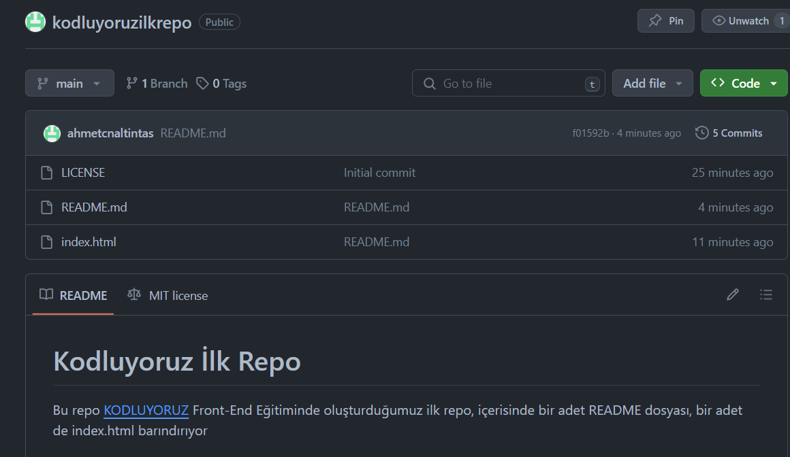

# Kodluyoruz İlk Repo

Bu repo [KODLUYORUZ](https://kodluyoruz.org/) Front-End Eğitiminde oluşturduğumuz ilk repo, içerisinde bir adet README dosyası, bir adet de index.html barındırıyor


# Installation

öncelikle projeyi clonelayın.(Buraya sizin reponuzdan aldığınız link gelecek)
```
git clone https://github.com/ahmetcnaltintas/kodluyoruzilkrepo.git
```

# Usage

Projeyi cloneladıktan sonra Visual Studio Code programında açınız.

Linux için:
```
cd kodluyoruzilkrepo
code .
```

# Contributing

Pull requestler kabul edilir.Büyük değişiklikler için, lütfen önce neyi değiştirmek istediğinizi tartışmak için konu açınız.

# Usage

[MIT](https://choosealicense.com/licenses/mit/)

